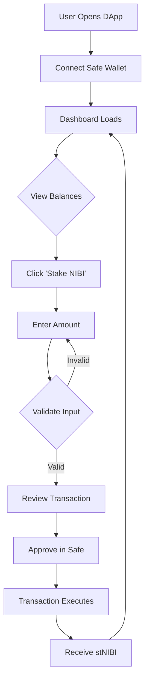
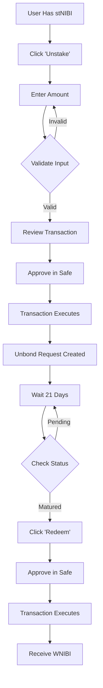

# Nibiru Liquid Staking DApp - QA Documentation

## Table of Contents

1. [Overview](#overview)
2. [Supported Networks](#supported-networks)
3. [Important Contract Addresses](#important-contract-addresses)
4. [Features and Functionality](#features-and-functionality)
5. [User Flows](#user-flows)
6. [Testing Scenarios](#testing-scenarios)
7. [Explorer Verification](#explorer-verification)

---

## Overview

The **Nibiru Liquid Staking DApp** is a Safe App designed for liquid staking on the Nibiru blockchain. It allows users to stake their NIBI tokens and receive stNIBI (liquid staking tokens) in return, which represent their staked position plus accrued rewards. Users can unstake their tokens (with a 21-day unbonding period) and redeem them for NIBI principal + rewards (converted to WNIBI).

### Technology Stack

- **Framework**: Next.js 14.2.5 (React 18)
- **Safe Integration**: Safe Apps SDK v4.7.2
- **Blockchain Library**: @nibiruchain/nibijs v3.1.0
- **State Management**: TanStack React Query v5.51.23
- **UI Framework**: Material-UI (MUI) v5.16.7
- **Wallet Provider**: Safe Global (Safe multisig)

---

## Supported Networks

The DApp supports **two networks**:

### 1. Mainnet

- **Chain ID**: `6900`
- **Network**: Nibiru Mainnet
- **Safe Transaction Service**: `https://transaction.safe.nibiru.fi`
- **Nibiru SDK Network**: `Mainnet()`

### 2. Testnet

- **Chain ID**: `6911`
- **Network**: Nibiru Testnet v2
- **Safe Transaction Service**: `https://transaction-testnet.safe.nibiru.fi`
- **Nibiru SDK Network**: `Testnet(2)`

> **QA Note**: The app automatically detects the network based on the Safe wallet's chain ID.

---

## Important Contract Addresses

### stNIBI Token Contracts (ERC-20)

The stNIBI token represents staked NIBI and uses **6 decimals**.

| Network | Chain ID | stNIBI Contract Address                      |
| ------- | -------- | -------------------------------------------- |
| Mainnet | 6900     | `0xcA0a9Fb5FBF692fa12fD13c0A900EC56Bb3f0a7b` |
| Testnet | 6911     | `0xb6Ec473BeE85DC99B1B350510f592b80F034b5DD` |

### Nibiru EVM Staking Contracts

Main staking contract that handles stake/unstake/redeem operations.

| Network | Chain ID | Nibiru EVM Contract Address                  |
| ------- | -------- | -------------------------------------------- |
| Mainnet | 6900     | `0xF8647cB104e87fFf4B886dC6BB9F2F01596d400D` |
| Testnet | 6911     | `0x85F75F0447Ffa035480A8C9b5699f66F155E2044` |

### Nibiru Eris Contracts (Bech32)

CosmWasm contracts for querying unbond requests on the Cosmos side.

| Network | Chain ID | Eris Contract Address (Bech32)                                    |
| ------- | -------- | ----------------------------------------------------------------- |
| Mainnet | 6900     | `nibi1udqqx30cw8nwjxtl4l28ym9hhrp933zlq8dqxfjzcdhvl8y24zcqpzmh8m` |
| Testnet | 6911     | `nibi1keqw4dllsczlldd7pmzp25wyl04fw5anh3wxljhg4fjuqj9xnxuqa82rpg` |

### Explorer Verification URLs

**Mainnet Explorers**:

- EVM Explorer: `https://evm.nibiru.fi/address/<address>`
- Cosmos Explorer: `https://explorer.nibiru.fi/nibiru-1/account/<address>`

**Testnet Explorers**:

- EVM Explorer: `https://evm-testnet.nibiru.fi/address/<address>`
- Cosmos Explorer: `https://explorer.nibiru.fi/nibiru-testnet-2/account/<address>`

> **QA Priority**: Verify all contract addresses exist on their respective networks through the explorers above.

---

## Features and Functionality

### 1. Dashboard Overview

The main page (`/src/app/page.tsx`) displays three primary cards:

#### A. NIBI Balance Card

- **Purpose**: Shows user's available NIBI balance for staking
- **Token**: Native NIBI token (18 decimals)
- **Action Button**: "Stake NIBI"
- **Button State**: Disabled when balance is 0 or unavailable
- **Data Refresh**: Polls every 15 seconds (`POLLING_INTERVAL`)

#### B. stNIBI Balance Card

- **Purpose**: Shows user's staked NIBI as stNIBI tokens
- **Token**: stNIBI (6 decimals)
- **Action Button**: "Unstake"
- **Button State**: Disabled when stNIBI balance is 0
- **Data Refresh**: Polls every 15 seconds

#### C. Redeem Card

- **Purpose**: Claims unstaked tokens after unbonding period
- **Action Button**: "Redeem Available" or "No Tokens to Redeem"
- **Button State**: Enabled only when claimable unbond requests exist
- **Data Refresh**: Checks every 15 seconds

#### D. Unstake Queue Display

- **Visibility**: Only shown when unbond requests exist
- **Information Displayed**:
  - Entry ID and status (PENDING/UNBONDING/CLAIMABLE)
  - Amount of stNIBI being unstaked
  - Estimated unlock time
  - Progress bar showing unbonding progress
- **Data Refresh**: Polls every 5 seconds via Nibiru Querier

### 2. Stake Flow (Liquid Staking)

**File**: `/src/components/tx-flow/flows/Stake/index.tsx`

**Functionality**:

- User deposits NIBI tokens
- Receives stNIBI at approximately 1:1 ratio (subject to exchange rate)
- stNIBI represents staked position + accrued rewards

**Contract Function**: `liquidStake(uint256 amount)`

**Validation Rules**:

1. Amount must be > 0
2. Minimum stake: 1 microNIBI = 0.000001 NIBI (1e12 wei)
3. Amount must be in multiples of 1 microNIBI
4. Cannot exceed available NIBI balance
5. Maximum 18 decimal places

**User Interactions**:

- Input field with "Max" button
- Shows available NIBI balance
- Shows estimated stNIBI to receive
- Form validation with error messages
- Transaction submission via Safe SDK

**Transaction Encoding**:

```typescript
// Encodes to: liquidStake(parsedAmount)
// Value: 0 (no native transfer needed, handled internally)
// To: NIBIRU_EVM_ADDRESSES[chainId]
```

### 3. Unstake Flow

**File**: `/src/components/tx-flow/flows/Unstake/index.tsx`

**Functionality**:

- User queues stNIBI for unstaking
- Initiates 21-day unbonding period
- Creates unbond request trackable via Cosmos querier

**Contract Function**: `unstake(uint256 stAmount)`

**Validation Rules**:

1. Amount must be > 0
2. Minimum unstake: 1 microNIBI equivalent (adjusting for 6 decimals)
3. Amount must be in multiples of 1 microNIBI
4. Cannot exceed available stNIBI balance
5. Maximum 6 decimal places (stNIBI decimals)

**User Interactions**:

- Input field with "Max" button
- Shows available stNIBI balance
- Form validation with error messages
- Transaction submission via Safe SDK

**Transaction Encoding**:

```typescript
// Encodes to: unstake(parsedAmountIn6Decimals)
// Value: 0
// To: NIBIRU_EVM_ADDRESSES[chainId]
```

**Important Notes**:

- Unstaking does NOT immediately return tokens
- Creates an unbond request with 21-day maturation period
- Multiple unstake requests can exist simultaneously
- Requests are batched on-chain

### 4. Redeem Flow

**File**: `/src/components/tx-flow/flows/Redeem/index.tsx`

**Functionality**:

- Claims all matured (unlocked) unbond requests
- Returns NIBI principal + accrued rewards
- **Rewards are converted to WNIBI (Wrapped NIBI)**

**Contract Function**: `redeem()`

**Button Enablement Logic**:

```typescript
// Disabled when:
// 1. No unbond requests exist, OR
// 2. No requests have finished unbonding (est_unbond_end_time <= now)
```

**User Interactions**:

- No input required (redeems ALL available)
- Shows informational alert about WNIBI conversion
- Transaction submission via Safe SDK

**Transaction Encoding**:

```typescript
// Encodes to: redeem()
// Value: 0
// To: NIBIRU_EVM_ADDRESSES[chainId]
// No parameters
```

**Important Notes**:

- Redeems ALL matured requests in a single transaction
- Cannot redeem partial amounts
- Received tokens are in WNIBI, not native NIBI
- Requires at least one unbond request to have passed the 21-day period

### 5. Unbond Request Tracking

**File**: `/src/app/page.tsx` (lines 71-96)

**Data Source**: Nibiru CosmWasm contract query

**Query Method**:

```typescript
wasmClient.queryContractSmart(NIBIRU_ERIS_ADDRESSES[chainId], {
  unbond_requests_by_user_details: { user: bech32Address },
});
```

**Address Conversion**: EVM address (0x...) → Bech32 (nibi...)

**Request States**:

1. **PENDING**: Waiting to start unbonding
2. **UNBONDING**: Currently unbonding (in batch)
3. **CLAIMABLE**: Unbonding complete, ready to redeem

**Request Structure**:

```typescript
interface UnbondRequest {
  id: number;
  shares: string;
  state: string;
  batch: {
    id: number;
    reconciled: boolean;
    total_shares: string;
    utoken_unclaimed: string;
    est_unbond_end_time: number; // Unix timestamp
  } | null;
  pending: {
    id: number;
    ustake_to_burn: string;
    est_unbond_start_time: number; // Unix timestamp
  } | null;
}
```

**Polling Frequency**: Every 5 seconds

### 6. Balance Queries

**File**: `/src/hooks/useLoadNibiruEvm.ts`

**Data Fetched**:

1. **NIBI Balance**: Native balance via `web3ReadOnly.getBalance(safeAddress)`
2. **stNIBI Balance**: ERC-20 `balanceOf(address)` call to stNIBI token contract
3. **Can Redeem**: Boolean derived from stNIBI balance > 0

**Query Mechanism**:

- Uses ethers.js provider for EVM calls
- TanStack React Query for caching and polling
- Refetch interval: 15 seconds
- Auto-refetch on wallet address change

**stNIBI Balance Call**:

```typescript
const stNibiBalanceCall = await web3ReadOnly.call(
  encodeGetStNibiBalance(safe.safeAddress, safe.chainId)
);
// Encodes: balanceOf(userAddress)
// To: ST_NIBI_TOKEN_ADDRESSES[chainId]
```

---

## User Flows

### Complete Staking Flow



### Complete Unstaking & Redemption Flow



### Unstake Ledger Computation

**File**: `/src/utils/unstakeLedger.ts`

The app tracks unstaking history from Safe transaction history:

**Event Types Tracked**:

1. **Mint Events** (`liquidStake`): Records when NIBI was staked
2. **Unstake Events** (`unstake`): Records when stNIBI was queued for unstaking
3. **Redeem Events** (`redeem`): Records when tokens were claimed

**Computed Metrics**:

- `estAvailableStNibi`: Estimated unlocked stNIBI
- `totalOutstandingUnstake`: Sum of Pending + Matured (not redeemed)
- `totalRedeemableNow`: Only matured entries

**Unbonding Period**: 21 days (1,814,400,000 milliseconds)

---

## Testing Scenarios

### Test Environment Setup

**Prerequisites**:

1. Safe wallet deployed on Nibiru Testnet (Chain ID 6911)
2. Test NIBI tokens in the Safe
3. Safe Apps SDK enabled
4. Access to Nibiru testnet explorer

### Scenario 1: First-Time Staking

**Objective**: Verify a user can stake NIBI and receive stNIBI

**Steps**:

1. Open DApp in Safe Apps interface
2. Verify dashboard displays current NIBI balance
3. Click "Stake NIBI" button
4. Enter amount: `1.0` NIBI
5. Click "Max" button to verify it fills max amount
6. Verify validation passes
7. Submit transaction
8. Approve transaction in Safe (requires threshold signatures)
9. Execute transaction
10. Wait for confirmation (15s polling)

**Expected Results**:

- ✅ NIBI balance decreases by staked amount
- ✅ stNIBI balance increases by approximately same amount
- ✅ Transaction appears in Safe transaction history
- ✅ "Unstake" button becomes enabled
- ✅ No errors in browser console

**Explorer Verification**:

- Verify transaction on EVM explorer
- Check `liquidStake` function call
- Verify token transfer events

### Scenario 2: Minimum Stake Amount

**Objective**: Test minimum staking validation

**Steps**:

1. Navigate to Stake flow
2. Enter `0.0000001` NIBI (below minimum)
3. Observe validation error

**Expected Results**:

- ✅ Error: "Minimum stake amount is 1 microNIBI (0.000001 NIBI)"
- ✅ Submit button disabled

**Valid Test**: 4. Enter `0.000001` NIBI (exactly minimum) 5. Verify validation passes

**Expected Results**:

- ✅ No validation errors
- ✅ Submit button enabled

### Scenario 3: Unstaking stNIBI

**Objective**: Verify unstaking creates unbond request

**Steps**:

1. Ensure stNIBI balance > 0
2. Click "Unstake" button
3. Enter `0.5` stNIBI
4. Submit and execute transaction
5. Wait for confirmation

**Expected Results**:

- ✅ stNIBI balance decreases
- ✅ "Unstake Queue" section appears on dashboard
- ✅ Entry shows status "PENDING" or "UNBONDING"
- ✅ Estimated unlock time displayed
- ✅ Progress bar shows 0% or small percentage

**Explorer Verification**:

- Check transaction on EVM explorer
- Verify `unstake` function called
- Query Eris contract for unbond requests

### Scenario 4: Multiple Unstake Requests

**Objective**: Verify multiple unstake requests are tracked

**Steps**:

1. Create first unstake request (0.5 stNIBI)
2. Wait 1 minute
3. Create second unstake request (0.3 stNIBI)
4. Check dashboard

**Expected Results**:

- ✅ Unstake Queue shows 2 entries
- ✅ Each entry has unique ID
- ✅ Progress bars show different percentages (if time passed)
- ✅ Total amounts sum correctly

### Scenario 5: Redeem Before Maturity

**Objective**: Verify redeem is disabled during unbonding

**Steps**:

1. Have active unbond request (< 21 days old)
2. Check "Redeem" button state
3. Observe unstake queue progress

**Expected Results**:

- ✅ "Redeem" button is disabled
- ✅ Button text: "No Tokens to Redeem"
- ✅ Progress bar shows < 100%
- ✅ Status is "PENDING" or "UNBONDING"

### Scenario 6: Redeem After Maturity (21+ Days)

**Objective**: Verify successful redemption after unbonding period

> **Note**: This requires waiting 21 days or using a testnet with shorter unbonding period.

**Steps**:

1. Wait until `est_unbond_end_time` has passed
2. Reload dashboard
3. Check unbond request status
4. Click "Redeem Available"
5. Execute transaction
6. Wait for confirmation

**Expected Results**:

- ✅ Status changes to "CLAIMABLE"
- ✅ Progress bar shows 100%
- ✅ "Redeem" button enabled
- ✅ After execution: WNIBI balance increases
- ✅ Unbond request removed or marked "Redeemed"
- ✅ Unstake queue entry disappears

**Explorer Verification**:

- Verify `redeem()` transaction
- Check WNIBI token transfer to Safe address

### Scenario 7: Invalid Input Testing

**Test Cases**:

| Input                                 | Expected Validation Error                          |
| ------------------------------------- | -------------------------------------------------- |
| `0`                                   | "Amount must be greater than 0"                    |
| `-5`                                  | "Amount must be greater than 0"                    |
| `abc`                                 | "Invalid amount"                                   |
| `1.0000000000000000001` (19 decimals) | "Maximum 18 decimal places" (for NIBI)             |
| `1.0000001` (7 decimals for stNIBI)   | "Maximum 6 decimal places" (for stNIBI)            |
| Balance + 1                           | "Insufficient balance" or "Amount exceeds balance" |

**Steps**:

1. For each test case, enter the input
2. Verify validation error appears
3. Verify submit button is disabled

### Scenario 8: Network Switching

**Objective**: Verify app handles network changes

**Steps**:

1. Open DApp on Testnet (6911)
2. Note displayed balances
3. Switch Safe to Mainnet (6900) or vice versa
4. Observe app behavior

**Expected Results**:

- ✅ App detects network change
- ✅ Balances refresh for new network
- ✅ Correct contract addresses used
- ✅ No errors or crashes
- ✅ Unstake queue shows data for current network

> **Warning**: Do NOT test network switching mid-transaction

### Scenario 9: Disconnected State

**Objective**: Test error handling when wallet disconnects

**Steps**:

1. Load DApp normally
2. Simulate wallet disconnect (if possible)
3. Observe UI behavior

**Expected Results**:

- ✅ Graceful error messages
- ✅ No blockchain calls attempted
- ✅ Loading states end appropriately

### Scenario 10: Transaction Rejection

**Objective**: Verify app handles rejected transactions

**Steps**:

1. Initiate stake transaction
2. Reject transaction in Safe interface
3. Return to DApp

**Expected Results**:

- ✅ Modal closes or shows error
- ✅ Balances unchanged
- ✅ User can retry transaction
- ✅ No stuck loading states

---

## Explorer Verification

### Critical Addresses to Verify

For **Testnet (Chain ID 6911)**:

1. **Nibiru EVM Contract**:

   - Address: `0x85F75F0447Ffa035480A8C9b5699f66F155E2044`
   - Verify at: `https://evm-testnet.nibiru.fi/address/0x85F75F0447Ffa035480A8C9b5699f66F155E2044`
   - Check: Contract verification, transaction count, code present

2. **stNIBI Token Contract**:

   - Address: `0xb6Ec473BeE85DC99B1B350510f592b80F034b5DD`
   - Verify at: `https://evm-testnet.nibiru.fi/address/0xb6Ec473BeE85DC99B1B350510f592b80F034b5DD`
   - Check: Token name "stNIBI", decimals = 6, total supply

3. **Eris Contract (Cosmos)**:
   - Address: `nibi1keqw4dllsczlldd7pmzp25wyl04fw5anh3wxljhg4fjuqj9xnxuqa82rpg`
   - Verify at: `https://explorer.nibiru.fi/nibiru-testnet-2/account/nibi1keqw4dllsczlldd7pmzp25wyl04fw5anh3wxljhg4fjuqj9xnxuqa82rpg`
   - Check: Contract exists, can be queried

For **Mainnet (Chain ID 6900)**:

1. **Nibiru EVM Contract**:

   - Address: `0xF8647cB104e87fFf4B886dC6BB9F2F01596d400D`
   - Verify at: `https://evm.nibiru.fi/address/0xF8647cB104e87fFf4B886dC6BB9F2F01596d400D`

2. **stNIBI Token Contract**:

   - Address: `0xcA0a9Fb5FBF692fa12fD13c0A900EC56Bb3f0a7b`
   - Verify at: `https://evm.nibiru.fi/address/0xcA0a9Fb5FBF692fa12fD13c0A900EC56Bb3f0a7b`

3. **Eris Contract (Cosmos)**:
   - Address: `nibi1udqqx30cw8nwjxtl4l28ym9hhrp933zlq8dqxfjzcdhvl8y24zcqpzmh8m`
   - Verify at: `https://explorer.nibiru.fi/nibiru-1/account/nibi1udqqx30cw8nwjxtl4l28ym9hhrp933zlq8dqxfjzcdhvl8y24zcqpzmh8m`

### Transaction Verification Checklist

After each transaction type, verify on explorer:

**For Stake Transactions**:

- ✅ Transaction status: Success
- ✅ Function called: `liquidStake`
- ✅ Input data decoded correctly
- ✅ Event logs show token mint
- ✅ Gas used reasonable

**For Unstake Transactions**:

- ✅ Transaction status: Success
- ✅ Function called: `unstake`
- ✅ Parameter `stAmount` matches input
- ✅ Event logs present
- ✅ No errors in transaction

**For Redeem Transactions**:

- ✅ Transaction status: Success
- ✅ Function called: `redeem`
- ✅ No parameters (as expected)
- ✅ WNIBI transfer events present
- ✅ Amount received matches expected

### Safe Transaction Service Verification

The DApp uses Safe's transaction service for history:

**Testnet**: `https://transaction-testnet.safe.nibiru.fi`  
**Mainnet**: `https://transaction.safe.nibiru.fi`

**Verify**:

1. Safe address appears in service
2. All transactions recorded
3. Transaction history complete
4. Data decoding works correctly

---

## Configuration Reference

### Key Configuration Files

**`/src/config/nibiruEvm.ts`**:

- Chain IDs
- Contract addresses (all networks)
- Token decimals
- Minimum stake amount

**`/src/config/constants.ts`**:

- Polling interval (15 seconds)

### Token Decimals

| Token  | Decimals | Notes                |
| ------ | -------- | -------------------- |
| NIBI   | 18       | Native token         |
| WNIBI  | 18       | Wrapped NIBI         |
| stNIBI | 6        | Liquid staking token |

> **Critical**: Always use correct decimals when parsing amounts!

### Minimum Stake Amount

- **Value**: `1e12` wei (in 18-decimal terms)
- **Human-readable**: 0.000001 NIBI (1 microNIBI)
- **Applies to**: Both stake and unstake

### Polling Intervals

- **Balance queries**: 15 seconds
- **Unbond request queries**: 5 seconds

---

## Common Issues & Troubleshooting

### Issue 1: "Redeem" button stays disabled

**Possible Causes**:

- Unbonding period not complete
- No unbond requests exist
- Query to Eris contract failing

**Debug Steps**:

1. Check browser console for errors
2. Verify unbond request exists via explorer
3. Check `est_unbond_end_time` timestamp
4. Ensure Cosmos querier is connected

### Issue 2: Balances not updating

**Possible Causes**:

- Network connectivity issues
- RPC endpoint down
- Polling disabled

**Debug Steps**:

1. Check browser network tab
2. Verify RPC calls returning data
3. Check React Query devtools
4. Manually refresh page

### Issue 3: Validation errors despite correct input

**Possible Causes**:

- Incorrect decimal places
- Amount not multiple of minimum
- Floating point precision issues

**Debug Steps**:

1. Check exact decimal count
2. Try "Max" button instead of manual entry
3. Check console for validation logs

### Issue 4: Transaction fails silently

**Possible Causes**:

- Safe threshold not met
- Insufficient gas
- Contract reverted

**Debug Steps**:

1. Check Safe transaction queue
2. Verify all signatures collected
3. Check transaction on explorer
4. Review contract error messages

---

## Appendix: Smart Contract Functions

### NibiruEvm Contract Interface

```solidity
interface INibiruEvm {
    /// @notice Deposit NIBI to stake and mint stNIBI
    /// @param amount Amount of NIBI in base units (18 decimals)
    function liquidStake(uint256 amount) external;

    /// @notice Queue stNIBI to unstake for later redemption
    /// @param stAmount Amount of stNIBI in base units (6 decimals)
    function unstake(uint256 stAmount) external;

    /// @notice Redeem all matured unstake requests
    /// Receives NIBI principal + rewards as WNIBI
    function redeem() external;
}
```

### stNIBI Token (ERC-20)

```solidity
interface IStNIBI {
    function balanceOf(address account) external view returns (uint256);
    function decimals() external view returns (uint8); // Returns 6
    // ... standard ERC-20 functions
}
```

---

## QA Sign-Off Checklist

Before approving a release, QA should verify:

- [ ] All contract addresses verified on explorers
- [ ] Testnet staking flow works end-to-end
- [ ] Unstaking creates trackable unbond request
- [ ] Redeem works after maturity period
- [ ] All validation rules enforced correctly
- [ ] Min/max amounts validated
- [ ] Decimal precision handled correctly
- [ ] Network switching works
- [ ] Transaction history tracked in Safe
- [ ] UI displays correct balances
- [ ] Polling/refresh works
- [ ] Error states handled gracefully
- [ ] No console errors during normal flow
- [ ] Safe Apps SDK integration stable
- [ ] Multi-signature workflow functions

---
